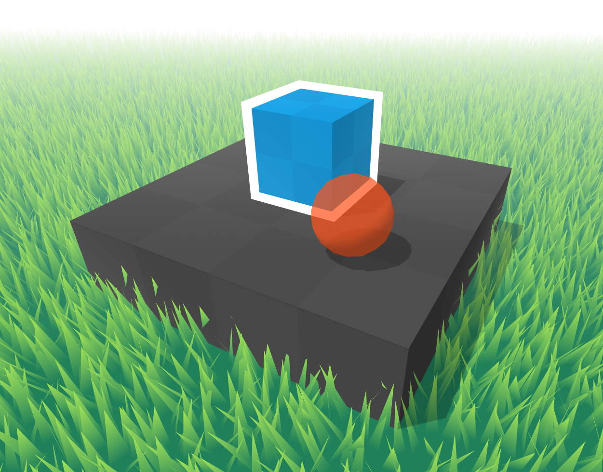

# Welcome to Goodie Toon Shaders!

This repository contains **Goodie Toon** shaders, which includes some features that may be useful for someone during their development process.
> These shaders are optimized for better performance, making them ideal for **mobile** and **web** environments.

## Base Type

The `Goodie Toon/Default` shader is a base type that includes the following settings:
* Main color and texture settings. The texture has relative and world transform options.
* Color and texture settings for object shadows.
* Ability to change the intensity, smoothness, and offset of the shadows, creating a toon-style look.
* Specular and rim settings.
* Animation setting.

> Shaders will be compiled for each option if it's enabled.

## Other Types

The following types are included in this shader pack:
* `Default` - basic shader type
* `Transparent` - basic shader type with transparency support
* `Outline` - basic shader type with outline support (the outline width is fixed and does not distort when scaling the object; it uses a vertex extrusion principle without jagged gaps in the outline)
* `Grass` - basic shader type with grass geometry generation and mesh tessellation support.
